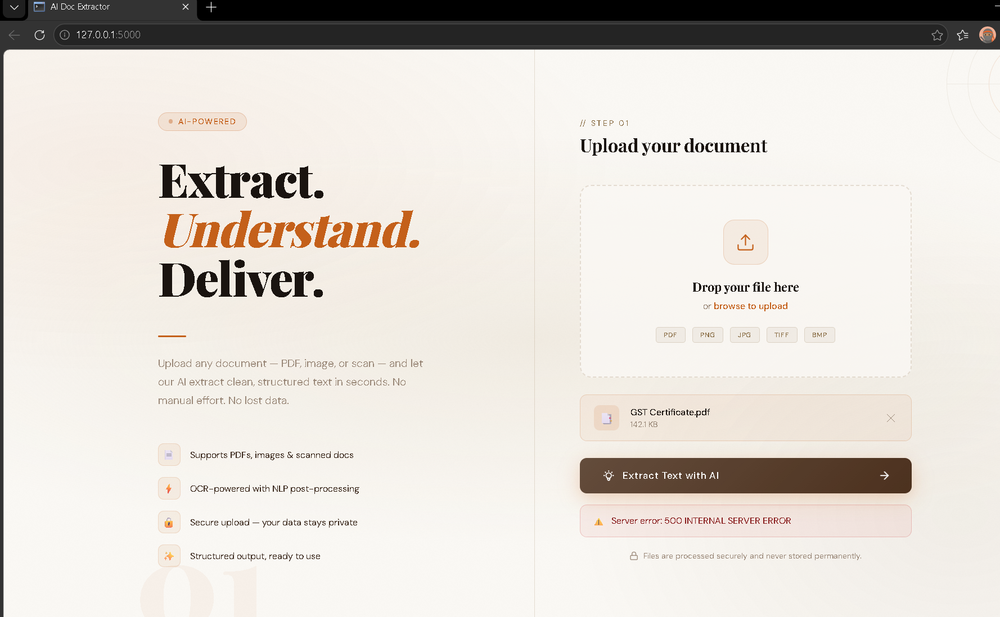

# AI Doc Extractor

## 📌 Overview
OCR-based system to extract structured text from images and PDFs.

## 🚀 Features
- Extract text from images and PDF documents
- Image preprocessing (denoising, thresholding)
- Flask backend for file upload and processing

## 🛠 Tech Stack
- Python
- Flask
- Tesseract OCR
- OpenCV

## 📊 Results
- Achieved ~90% accuracy on 80+ test documents

## 📸 Demo

<p align="center">
  
</p>

## ⚙️ How to Run
```bash
git clone https://github.com/your-repo
cd your-repo
pip install -r requirements.txt
python app.py